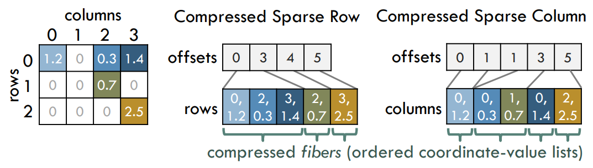
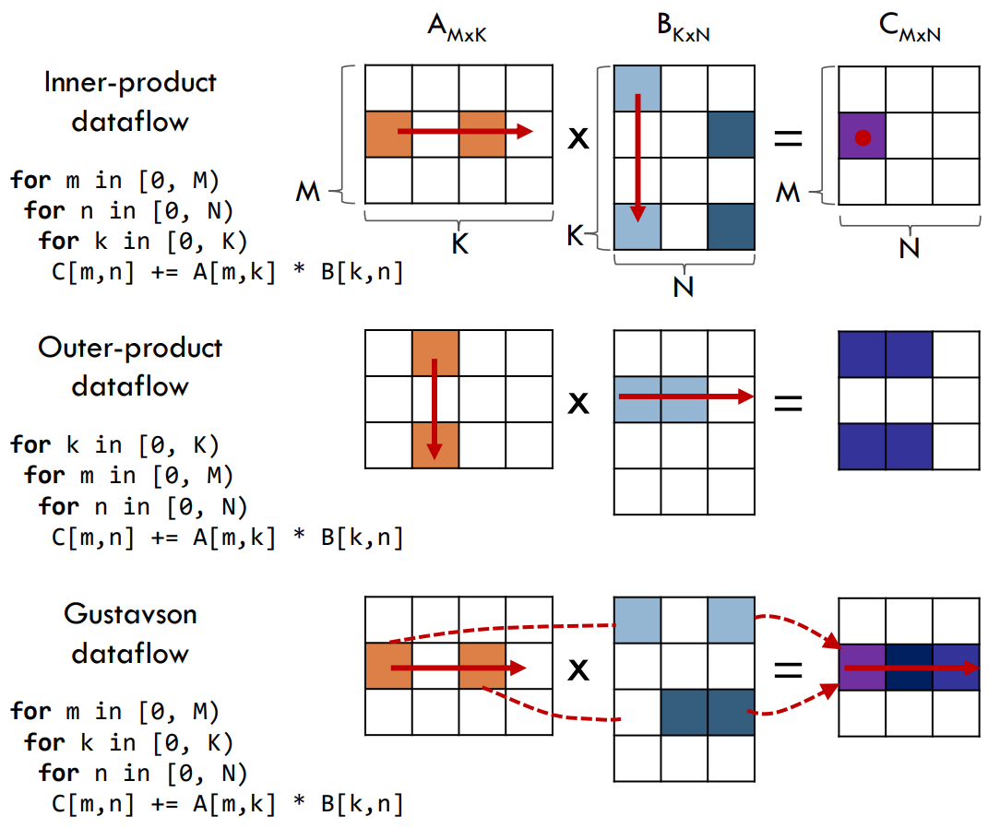

## Significance

提高了稀疏矩阵乘法（spMspM）的性能，降低存储空间。应用于深度学习、线性代数及图分析等，是解析、搜索及优化等任务的关键部分。

## Motivation

问题特性：

1. 运算较少
2. 访存随机

Gustavson算法：行平稳的数据流，改善访存，但存在不规则的数据重用。

## Contribution

1. 使用了之前被错过的Gustavson算法
2. 对于不规则的数据重用构建了新的缓存结构
3. 对于特定病态数据的预处理技术

## Details

### 压缩存储结构

- 压缩稀疏行（CSR）

  非零元素保存列标号，使用额外的一个offset数组标记每一行的起始位置。

- 压缩稀疏列（CSC）

### 数据流

- 内积：良好的输出重用性；输入可能无效
- 外积：良好的输入重用性；输出难以组合
- Gustavson：行平稳

### 行重排预处理

矩阵A并行的行尽可能多的重用矩阵B中的行。

算法：维护一个优先队列，保存待处理的A的行 所需要的 但未被缓存的行。

改进：对于非零元素较多的A的行进行拆分，以适应行复用及缓存空间的大小。

## Evaluation

1. 原文还有芯片设计相关的细节
2. 提升性能的重点为优化访存（计算与缓存）
3. 针对性能/存储较差的芯片进行的稀疏矩阵乘法优化，但有学习的价值。
