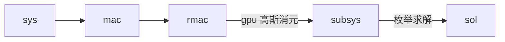
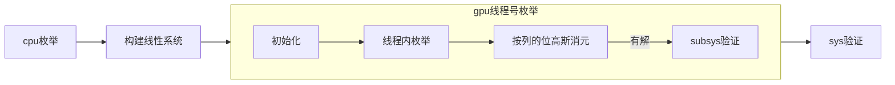

# Code Review

[mqsolver](https://github.com/kcning/mqsolver)

[paper](./MScThesis_2017_MQGPU.pdf)

[sildes](./MScThesis_2017_MQGPU_CR_marp_mmd.html)

## 基本流程



## rmac.cu/rmac_elim_cpu

对约化后的macaulay矩阵（稠密）进行cpu多线程高斯消元。

- 多线程寻找主元行，并记录所有主元列为1的行号

  主线程：将剩余所有行平均分配给所有线程。

  线程函数：

  ```c++
  static void
      find_pvt_rows_cpu(void* dummy) {
      fpvt_arg* arg = (fpvt_arg*) dummy;

      uint64_t count = 0;
      for(uint64_t i = arg->start; i < arg->end; ++i) {
          uint64_t* const row = rmac_row(arg->sys, i);
          if( drm_at(row, arg->col_idx) ) {
              arg->local_indices[count++] = i;
          }
      }

      if(count) {
          // copy the local indices into global one
          pthread_mutex_lock(arg->index_lock);

          uint64_t offset = *(arg->index_offset);
          *(arg->index_offset) += count;

          pthread_mutex_unlock(arg->index_lock);

          memcpy(arg->indices + offset, arg->local_indices, sizeof(uint32_t) * count);
      }
  }
  ```

- 多线程进行行约化

  主线程：将indices中存储的需要被约化的行平均分配给每个线程。

  线程函数：

  ```c++
  static void
  reduce_rows_cpu(void* dummy) {
      reduc_arg* arg = (reduc_arg*) dummy;
  
      const uint64_t* const pvt = rmac_row(arg->sys, arg->indices[0]);
      for(uint64_t i = arg->start; i < arg->end; ++i) {
          uint64_t* const dst = rmac_row(arg->sys, arg->indices[i]);
          rmac_xor_after(arg->sys, dst, pvt, arg->col_idx);
      }
  }
  ```

- 行交换（只换指针）

## rmac.cu/rmac_elim_gpu

对约化后的macaulay矩阵（稠密）进行gpu多线程高斯消元。

- 初始化

  ```c++
  // 偏好更多的共享内存
  cudaFuncSetCacheConfig(reduc_rows, cudaFuncCachePreferShared);
  // 修改Bank模式 （可选4Byte或8Byte）
  cudaFuncSetSharedMemConfig(reduc_rows, cudaSharedMemBankSizeEightByte);
  ```

  ```c++
  static __global__ void
  rmac_elim_init(uint64_t* const sys, uint64_t** rows, uint32_t* row_indices,
                 const uint32_t eq_num, uint32_t slot_num) {
  
      const uint32_t tid = global_tid();
      if(tid < eq_num) {
          rows[tid] = sys + tid * slot_num;
          row_indices[tid] = tid;
      }
  }
  ```

- 寻找主元行
  每行对应一个线程

  ```c++
  static __global__ void
  find_pvt_rows(uint64_t** __restrict__ rows, const uint32_t eq_num,
                const uint32_t start, const uint32_t col_idx,
                uint32_t* const __restrict__ indices,
                uint32_t* const __restrict__ rcount) {
  
      const uint32_t tid = global_tid();
      if(start <= tid && tid < eq_num) {
          uint64_t* row = rows[tid];
              
          // check the target monomial in the row
          if( drm_at(row, col_idx) ) {
              indices[atomicAdd(rcount, 1)] = tid;
          }
      }
  }
  ```

- 进行行约化

  每列（64位）对应一个线程

  此处的共享内存没有意义，应使用==寄存器==。

  ```c++
  static __global__ void
  reduc_rows(uint64_t** __restrict__ rows, const uint32_t slot_num,
             const uint32_t start, uint32_t* const __restrict__ indices,
             const uint32_t rcount) {
  
      extern __shared__ uint64_t smem[];
      const uint32_t tid = global_tid();
  
      if(start + tid < slot_num) {
          uint64_t* src = rows[indices[0]];
  
          // copy src into shared memory
          smem[threadIdx.x] = src[start + tid];
  
          // no need to sync
  
          // for each rows below
          for(uint32_t i = 1; i < rcount; ++i) {
              uint64_t* dst = rows[indices[i]];
              dst[start + tid] ^= smem[threadIdx.x];
          }
      }
  }
  ```

- 行交换（只换指针）

## mqsolver.cu/bf_subsys

在高斯消元后保留64个方程作为子系统（非线性）。



- cpu枚举

  - 选择线性方程（最多32个），非线性方程作为subsys的验证
  - 改变存储方式（列），一列保存在一个u32中

- gpu枚举

  - 初始化：格雷码枚举顺序（线程内枚举）的剩余变量系数的偏导数（变量的差），为了快速的获得高斯消元数据。

  - 按列的位高斯消元（以3个变量为例）：

    $$
    \begin{bmatrix}
    mask & x_1 & x_2 & x_3 & b \\
    1 & 0 & 1 & 1 & 0 \\
    1 & 1 & 0 & 0 & 1 \\
    1 & 0 & 1 & 0 & 0 \\
    1 & 1 & 0 & 0 & 1 \\
    1 & 0 & 0 & 1 & 1
    \end{bmatrix}
    \to
    \begin{bmatrix}
    mask & x_1 & x_2 & x_3 & b \\
    1 & 0 & 1 & 1 & 0 \\
    0 & 1 & 0 & 0 & 1 \\
    1 & 0 & 1 & 0 & 0 \\
    1 & 0 & 0 & 0 & 0 \\
    1 & 0 & 0 & 1 & 1
    \end{bmatrix}
    \to
    \begin{bmatrix}
    mask & x_1 & x_2 & x_3 & b \\
    0 & 0 & 1 & 1 & 0 \\
    0 & 1 & 0 & 0 & 1 \\
    1 & 0 & 0 & 1 & 0 \\
    1 & 0 & 0 & 0 & 0 \\
    1 & 0 & 0 & 1 & 1
    \end{bmatrix}
    \to
    \begin{bmatrix}
    mask & x_1 & x_2 & x_3 & b \\
    0 & 0 & 1 & 1 & 0 \\
    0 & 1 & 0 & 0 & 1 \\
    0 & 0 & 0 & 1 & 0 \\
    1 & 0 & 0 & 0 & 0 \\
    1 & 0 & 0 & 0 & 1
    \end{bmatrix}
    $$

    ```c++
    uint32_t rmask = ~0x0U;
    {
        uint32_t tmp = lsys0 & rmask;
        uint32_t sf = (!tmp) ? 0x0U : ~0x0U;
        uint32_t piv = ctz(tmp);
        rmask ^= (0x1U << piv) & sf;
        uint32_t mask = (lsys0 ^ (0x1U << piv) ) & sf;
        lsys0 ^= mask;
            lsys1 ^= mask & (((lsys1 >> piv) & 0x1U) ? ~0x0U : 0x0U);
            lsys2 ^= mask & (((lsys2 >> piv) & 0x1U) ? ~0x0U : 0x0U);
            lsys3 ^= mask & (((lsys3 >> piv) & 0x1U) ? ~0x0U : 0x0U);
    }
    {
        uint32_t tmp = lsys1 & rmask;
        uint32_t sf = (!tmp) ? 0x0U : ~0x0U;
        uint32_t piv = ctz(tmp);
        rmask ^= (0x1U << piv) & sf;
        uint32_t mask = (lsys1 ^ (0x1U << piv) ) & sf;
        lsys1 ^= mask;
            lsys2 ^= mask & (((lsys2 >> piv) & 0x1U) ? ~0x0U : 0x0U);
            lsys3 ^= mask & (((lsys3 >> piv) & 0x1U) ? ~0x0U : 0x0U);
    }
    {
        uint32_t tmp = lsys2 & rmask;
        uint32_t sf = (!tmp) ? 0x0U : ~0x0U;
        uint32_t piv = ctz(tmp);
        rmask ^= (0x1U << piv) & sf;
        uint32_t mask = (lsys2 ^ (0x1U << piv) ) & sf;
        lsys2 ^= mask;
            lsys3 ^= mask & (((lsys3 >> piv) & 0x1U) ? ~0x0U : 0x0U);
    }
    solvable = !(lsys3 & rmask);
    ```

    有解时变量取值：

    ```c++
    sol |= ( (lsys3 >> ctz(lsys0)) & 0x1U ) << 0;
    sol |= ( (lsys3 >> ctz(lsys1)) & 0x1U ) << 1;
    sol |= ( (lsys3 >> ctz(lsys2)) & 0x1U ) << 2;
    ```
